# Frogwatch+

A mobile citizen science app for recording and identifying frog species using AI-powered audio analysis. Built for volunteers, researchers, and experts to collaboratively build a database of frog call recordings tagged with GPS location data.

<p align="center">
  
</p>

## What It Does

Frogwatch+ turns your smartphone into a field research tool. Walk outside, record a frog call, and the app identifies the species using a machine learning model hosted on Google Cloud. Every recording is tagged with your GPS coordinates and stored in Firebase, contributing to a growing scientific dataset of frog populations across different regions.

The app supports 8 species found in the Great Lakes region:
- American Toad
- Bullfrog
- Eastern Gray Treefrog
- Green Frog
- Midland Chorus Frog
- Northern Leopard Frog
- Northern Spring Peeper
- Wood Frog

## Screenshots

### Home & Recording

<p align="center">
  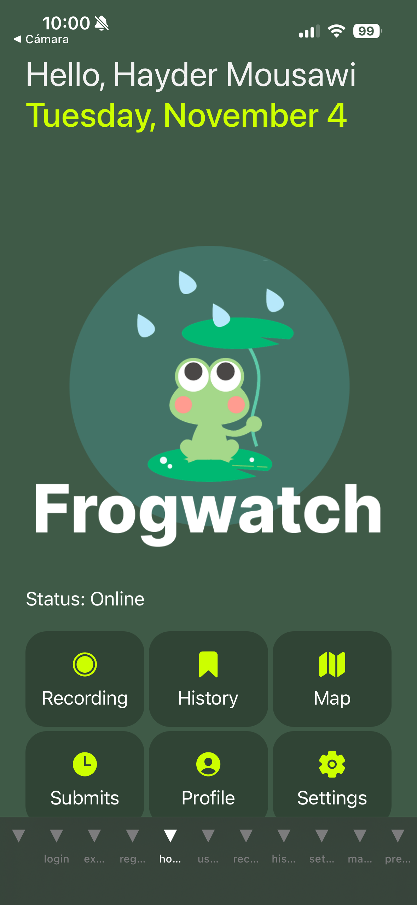
  &nbsp;&nbsp;
  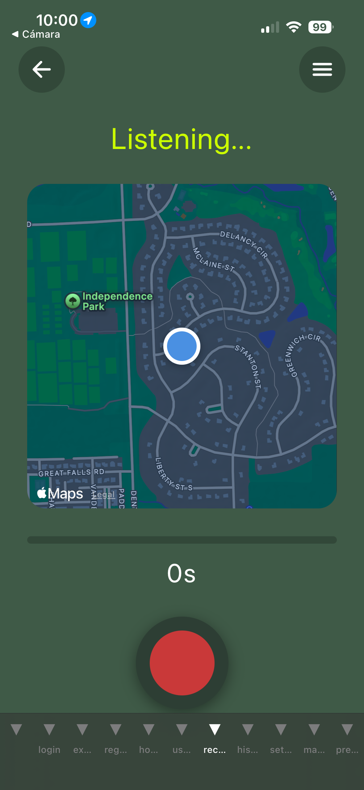
  &nbsp;&nbsp;
  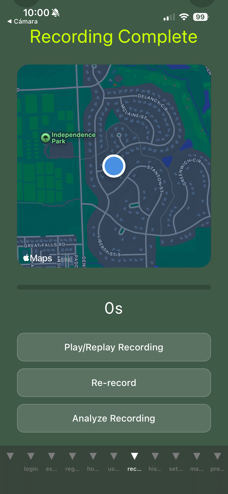
</p>

The **home screen** shows your status and quick navigation to all features. The **recording screen** uses your device microphone to capture up to 10 seconds of audio while displaying your GPS location on an interactive map. After recording, you can replay, re-record, or send it off for AI analysis.

### AI Prediction & Submission

<p align="center">
  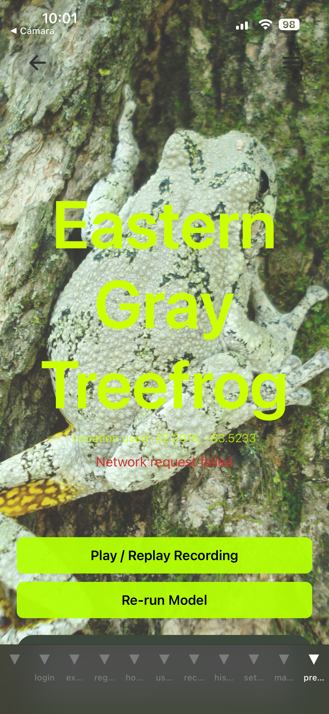
  &nbsp;&nbsp;
  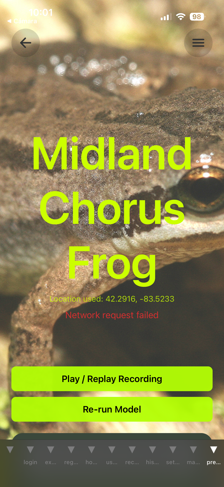
  &nbsp;&nbsp;
  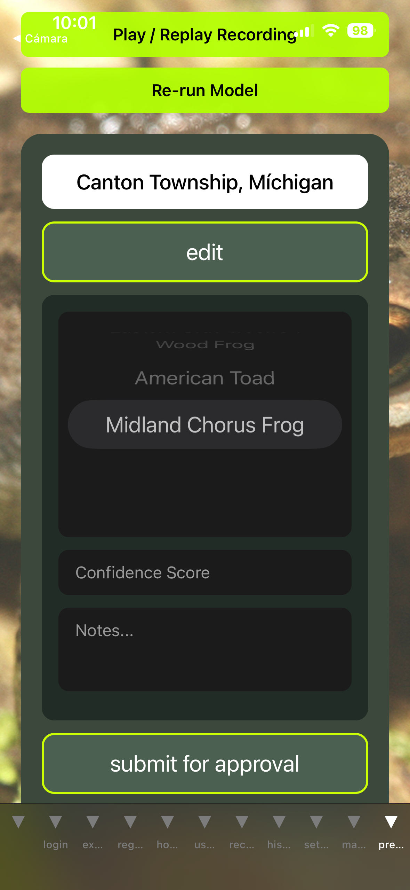
</p>

The AI model returns its top species prediction displayed over a full-screen photo of the identified frog. You can review the result, add your own confidence score and notes, then **submit for expert approval** -- or re-run the model if you disagree.

### Recording History

<p align="center">
  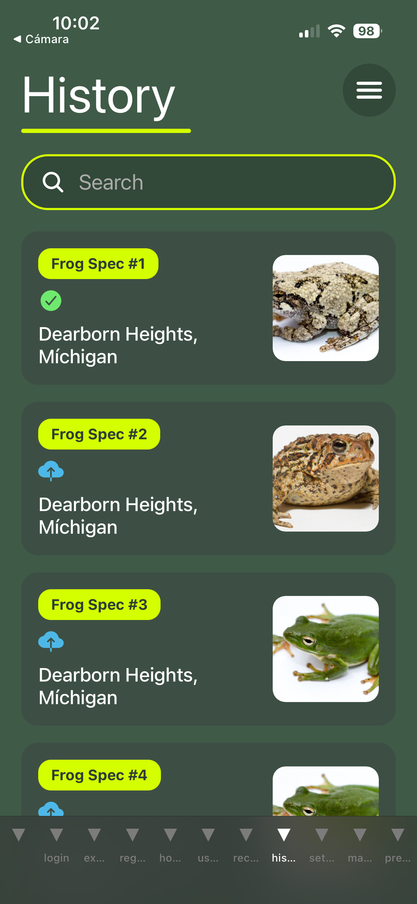
  &nbsp;&nbsp;
  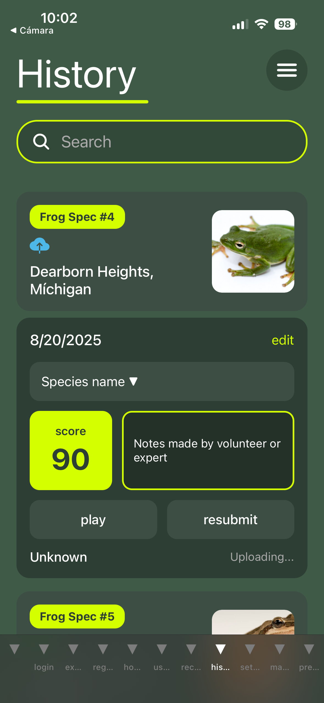
  &nbsp;&nbsp;
  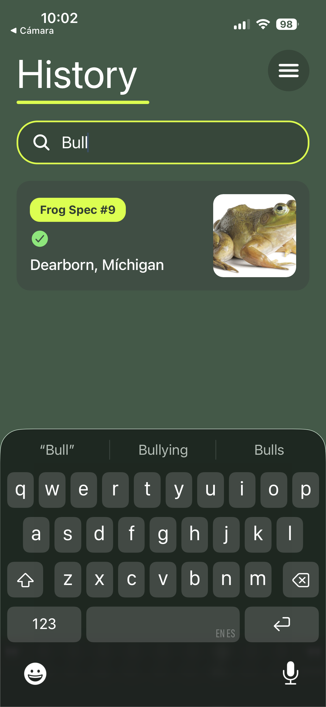
</p>

Browse all your past recordings with species thumbnails, location info, and status indicators (Approved, Pending Review, Uploading). Expand any card to see the AI confidence score, replay the audio, edit your submission, or resubmit. Search and filter by species name or location.

### Map View

<p align="center">
  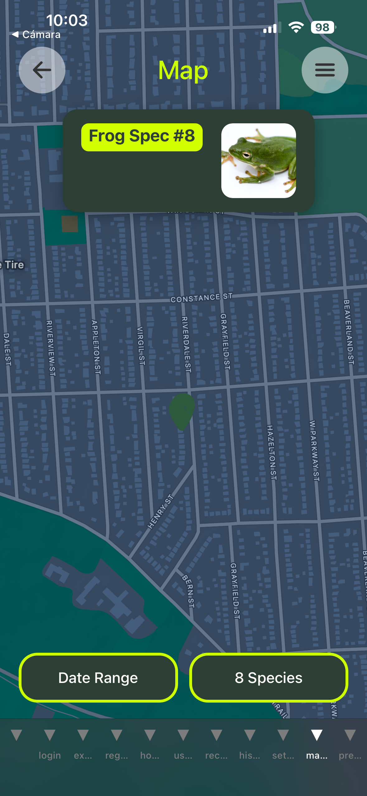
  &nbsp;&nbsp;
  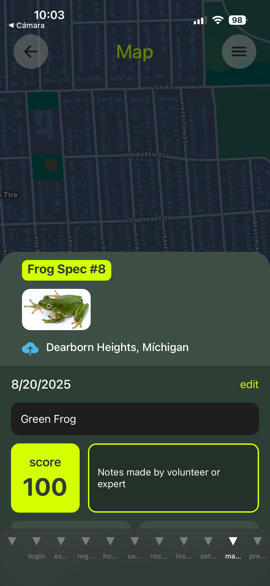
  &nbsp;&nbsp;
  
</p>

View all recordings plotted on an interactive map. Tap any marker to see species details, confidence scores, and playback controls. Filter by **date range** and **species** to explore patterns in frog populations across different locations.

## Tech Stack

| Layer | Technology |
|-------|-----------|
| Framework | React Native + Expo |
| Language | TypeScript |
| Navigation | Expo Router (file-based) |
| Auth | Firebase Authentication |
| Database | Cloud Firestore |
| File Storage | Firebase Cloud Storage |
| ML Backend | Google Cloud Run |
| Maps | React Native Maps + OpenStreetMap |
| Audio | Expo Audio |
| Location | Expo Location |

## Getting Started

### Prerequisites

- Node.js 18+
- npm or yarn
- [Expo CLI](https://docs.expo.dev/get-started/installation/)
- iOS Simulator / Android Emulator / Physical device with [Expo Go](https://expo.dev/go)

### Setup

1. Clone the repository:
   ```bash
   git clone https://github.com/GHXST/Frogwatch.git
   cd Frogwatch
   ```

2. Install dependencies:
   ```bash
   npm install
   ```

3. Configure environment variables:
   ```bash
   cp .env.example .env
   ```
   Fill in your Firebase and API configuration values.

4. Start the development server:
   ```bash
   npx expo start
   ```

5. Open the app on your device using Expo Go, or run on a simulator/emulator.

## Project Structure

```
app/
├── (tabs)/
│   ├── recordScreen.tsx      # Audio recording with GPS
│   ├── predictionScreen.tsx  # AI species identification
│   ├── historyScreen.tsx     # Recording history list
│   ├── mapHistoryScreen.tsx  # Map visualization
│   ├── login.tsx             # Authentication
│   └── register.tsx          # Account creation
├── firebaseConfig.ts         # Firebase setup
└── _layout.tsx               # Root layout & navigation
services/
├── api.ts                    # Backend API client
├── config.ts                 # API configuration
├── logger.ts                 # Logging utility
└── getUserRole.ts            # Role-based access
assets/
├── frogs/                    # Species thumbnail images
└── frogs_background/         # Full-screen species photos
```

## Role-Based Access

The app supports three user roles with tailored home screens and permissions:

- **Volunteer** -- Record frog calls and submit for review
- **Expert** -- Review and approve volunteer submissions
- **Admin** -- Full system management access

## License

This project was developed for scientific research and citizen science initiatives.
